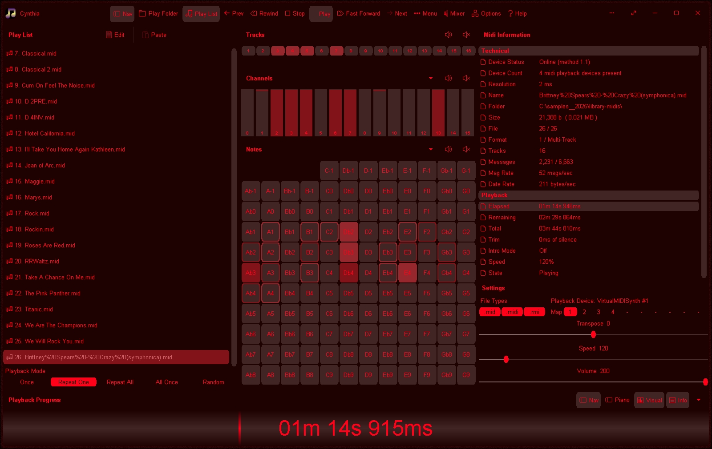

# Cynthia v1.0.6062 / 09nov2025 / MIT License
Reliably play midi music files from a folder or ".m3u" playlist. Adjust playback speed, volume and output device on the fly during playback. A large playback progress bar makes jumping forward and backward in time a breeze with just a single click or tap. Supports ".mid", ".midi" and ".rmi" files in format 0 (single track) and format 1 (multi-track). Comes complete with 24 sample midis ready to play.

# Features
* Dual play systems - Play Folder and Play List
* Comes with 25 built-in sample midis on a virtual disk
* Elapsed, Remaining and Total time readouts
* Device Status, Device Count, Msgs/sec and Data Rate readouts
* Native ".m3u" playlist support (copy, paste, open, save, build)
* Drag and drop midi files to play/add to playlist
* Play Modes: Once, Repeat One, Repeat All, All Once, Random
* Standard Play Speed Range: 50% to 200% (0.5x to 2x)
* Extended Play Speed Range: 10% to 1,000% (0.1x to 10x)
* Intro Mode: Play first 2s, 5s, 10s or 30s of midi
* Rewind/Fast Forward by: 1s, 2s, 5s, 10s or 30s
* Play on Start option - playback commences on app start
* Always on Midi option - maintain connection to midi device(s) for instant playback
* Auto Fade In - eliminate loud or abrupt notes during rewind, fast forward or reposition operations
* Playback Progress bar - click to reposition/jump backward or forward in time
* Volume control with volume boost (up to 200%)
* "Mixer" link - display Windows "Volume Mixer" app
* Play ".mid", ".midi" and ".rmi" midi files in 0 and 1 formats
* Scrolling lyrics viewer
* Detailed midi information panel
* Tracks Panel: Realtime track data indicators, display flat or shaded, with mute all, unmute all, and mute individual track options 
* Channels Panel: Realtime channel output volume indicators with peak level hold and variable hold time, display flat or shaded, unmute all, mute all, and mute individual channel options
* Mixer: Adjust individual channel volume levels from 0% to 200%
* Option: Number channels 0-15 or 1-16
* Notes Panel: 128 realtime note usage indicators with variable hold time, 8-12 notes per line, labels as letters or numbers, display flat or shaded, unmute all, mute all, and mute individual note options
* Option: Number notes 0-127 or 1-128
* Piano Panel: View realtime piano keystrokes on a 128, 88, 76, 61, 54, 49 or 37 key keyboard
* Piano Keystroke Illumination: Off, Flat, Shade Up, Shade Down, Subtle, Subtle 2, Leading Edge, and Leading Edge 2
* Piano: Mark middle C key, C + F keys, or all white keys
* Volume Bars: Realtime average volume and bass volume levels (left and right vertical)
* Transpose option: Shift all notes up/down music scale
* Use an Xbox Controller to control Cynthia's main functions: Playback speed, volume, song position, display panels, song file navigation, jump to start of song, toggle fullscreen mode, etc
* Large list capacity for handling thousands of midi files
* Switch between up to 10 midi playback devices
* Supports playback through a single midi device, or multiple simultaneous midi devices
* Multi-Device Options (per midi device): Time Shift - adjust playback timing to compensate for midi device lag from -500 ms to +500 ms, Device Volume - adjust output volume from 0% to 200%, Output Channels - select which midi channels to play through the device
* Automatic Midi Device(s) Resync - detects OS changes in midi device ordering/names and corrects in realtime
* Custom built midi playback engine for high playback stability
* Automatic compact mode for display on small/low resolution screens
* Simple and easy to use
* Options Window - Easily change app color, font, and settings
* Portable
* Smart Source Code (Borland Delphi 3 and Lazarus 2) 

# Download
Download <a href="src/cynthia.exe">cynthia.exe</a> or from the "<a href="bin/">bin</a>" or "<a href="src/">src</a>" folders above.

# Images

 

 

 

