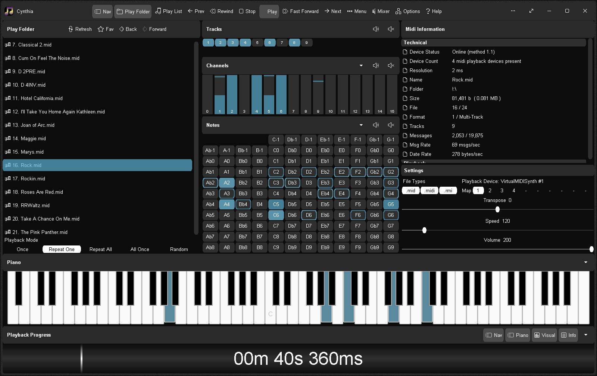
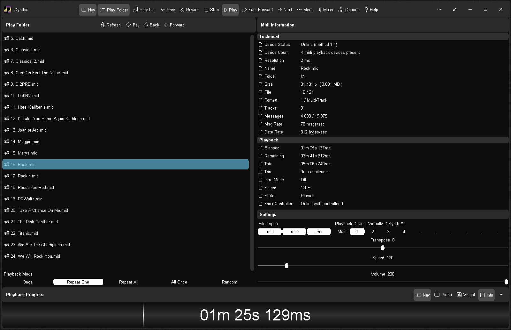

# Cynthia v1.00.4830 - 03jul2025
Reliably play midi music files from a folder or ".m3u" playlist. Adjust playback speed, volume and output device on the fly during playback. A large playback progress bar makes jumping forward and backward in time a breeze with just a single click or tap. Supports ".mid", ".midi" and ".rmi" files in format 0 (single track) and format 1 (multi-track). Comes complete with 24 sample midis ready to play.

# Features
* Dual play systems - Play Folder and Play List
* Comes with 24 built-in sample midis on a virtual disk
* Elapsed, Remaining and Total time readouts
* Native ".m3u" playlist support (copy, paste, open, save, build)
* Drag and drop midi files to play / add to playlist
* Play Modes: Once, Repeat One, Repeat All, All Once, Random
* Play Speed: 10% to 1,000% (1/10th to 10x)
* Intro Mode: Play first 2s, 5s, 10s or 30s of midi
* Rewind / Fast Forward by: 1s, 2s, 5s, 10s or 30s
* Play on Start option - playback commences on app start
* Always on Midi option - maintain connection to midi device for instant playback
* Auto Fade In - eliminate loud or abrupt notes during rewind, fast forward or reposition operations
* Playback Progress bar - click to reposition/jump backward or forward in time
* Volume control with volume boost (up to 200%)
* Mixer link - display Windows "Volume Mixer" app
* Play ".mid", ".midi" and ".rmi" midi files in 0 and 1 formats
* Custom built midi playback subsystem for high playback stability
* Scrolling lyrics viewer
* Detailed midi information panel
* Tracks Panel: Realtime track data indicators with mute all, unmute all, and mute individual track options 
* Channels Panel: Realtime channel output volume indicators with peak level hold and variable hold time, unmute all, mute all, and mute individual channel options
* Notes Panel: 128 realtime note usage indicators with variable hold time, 8-12 notes per line display, labels as letters or numbers, unmute all, mute all, and mute individual note options
* Piano Panel: View realtime piano keystrokes on a 128, 88, 76, 61, 54, 49 or 37 key keyboard with animated and lit keystrokes
* Piano: Mark middle C key, C + F keys, or all white keys
* Transpose option: Shift all notes up or down music scale
* Use an Xbox Controller to control Cynthia's main functions - playback speed and volume, song position, display panels, song file navigation, jump to start of song, toggle fullscreen mode, etc
* Large list capacity for handling thousands of midi files
* Switch between up to 10 midi playback devices
* Simple and easy to use
* Options Window - Easily change app color, font and settings
* Portable

# Download
<a href="src/cynthia.exe">cynthia.exe</a> - windows all

# Images

 

 

 

